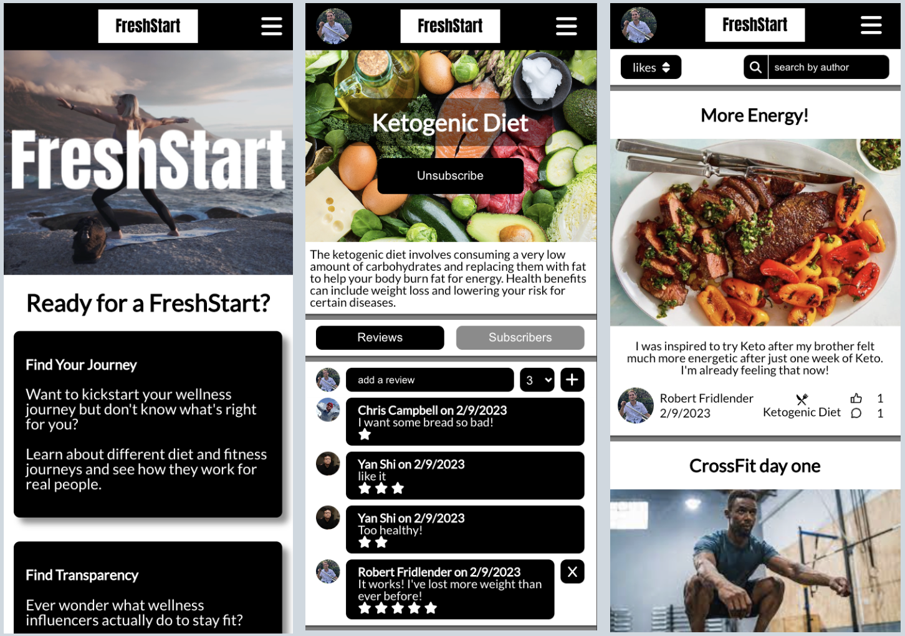

# [FreshStart](https://startfresh.netlify.app/)

We built FreshStart to connect wellness creators with people who are on or starting a new wellness journey. Have you ever wanted to start a wellness journey but don't know what's right for you? On FreshStart you gain a transparent view into the real lives of wellness experts who share their diet and exercise routines and how their wellness joruneys make them feel.

If you're starting a new wellness brand and need to build an audience, there's no better place to connect with like-minded people than FreshStart.

For people who are new to their wellness journey you can track your workouts, meals, and how your wellness journey is making you feel. Follow your friends for accountability and find wellness together.

## [Start your journey here!](https://startfresh.netlify.app/)

**[Planning Materials](https://trello.com/b/1Rmggolj/freshstart-project-plan)**

**[FreshStart Back-End](https://github.com/robfrid06/fresh-start-back-end/tree/profiles-router)**

## Contributors

- [Robert Fridlender](https://github.com/robfrid06)
- [Chris Campbell](https://github.com/ChrisCampbell1)
- [Yan Shi](https://github.com/leonshiyan)

## Technologies Used

## Icebox

- [ ] Allow users to track their progress through metrics within each post
- [ ] Allow users to view their progress on charts
- [ ] Utilize Edamam API to allow users to track calories of the foods they eat
- [ ] Allow users to add a bio to their prophile
- [ ] Implement user roles to allow admins to create new Journeys and promote users to creators
- [ ] Implement creator status
- [ ] Improve desktop experience
